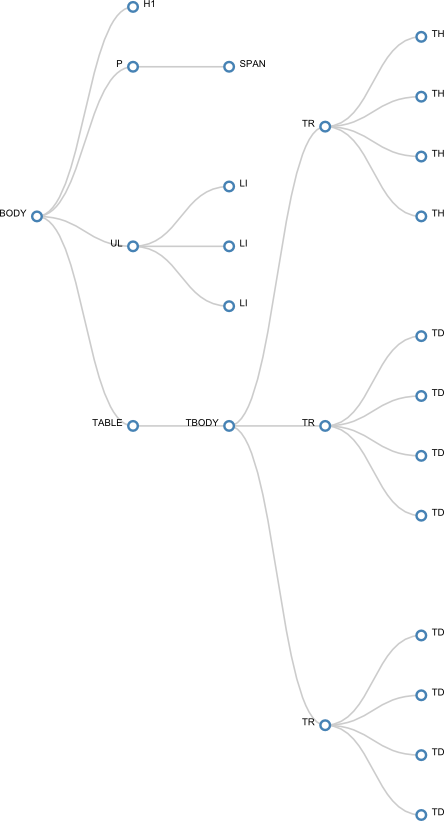
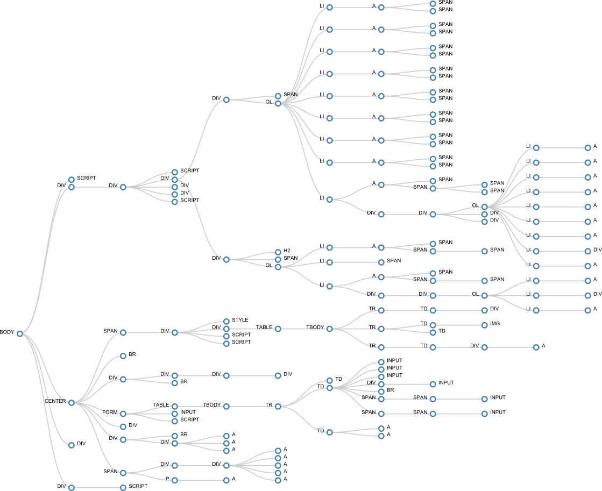

dom2svg
=======
_Draft version_

Draw web page's DOM to svg file via d3.js.  
The output is an SVG you can load into Inkscape, Illustrator, or one that we can convert to an EPS, a PDF, render to a PNG or any other image file format you can think of.

## Install

With npm do:

    npm install

### Dependencies

We assume that node.js is already installed.

d3.js and [jsdom](http://github.com/tmpvar/jsdom) modules are necessary. Prerequisites for [Windows](http://github.com/tmpvar/jsdom#windows) users.

## Usage

    node dom2svg.js <http://sample.com | ./path/page.html> <file_to_write.svg>

### Example

    node dom2svg.js ./samples/prueba.html prueba.svg

    node dom2svg.js http://www.google.es google.svg

## License
MIT
